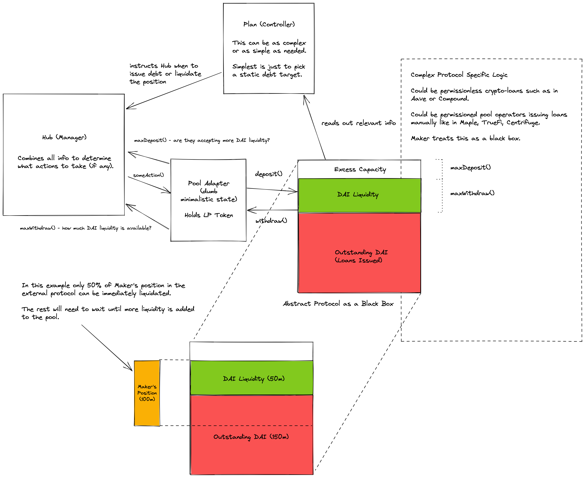

# MIP50: Dai Direct Deposit Module

## Preamble

```
MIP#: 50
Title: Dai Direct Deposit Module
Author(s): Sam MacPherson (@hexonaut)
Contributors: None
Tags: technical, integrations
Type: Technical
Status: Accepted
Date Proposed: 2021-04-07
Date Ratified: 2021-05-25
Dependencies: n/a
Replaces: n/a
License: AGPL3+  
Ratification Poll URL: https://vote.makerdao.com/executive/template-executive-vote-approve-may-2021-governance-cycle-may-24-2021?network=mainnet#proposal-detail  
Forum URL: https://forum.makerdao.com/t/mip50-direct-deposit-module/7356
```

## References

* The proposed [code](https://github.com/makerdao/dss-direct-deposit)
* [D3M Proposal](https://forum.makerdao.com/t/discussion-direct-deposit-dai-module-d3m/7357)

## Sentence Summary

This proposal provides a smart contract implementation of a Dai Direct Deposit Module (D3M) for Maker.

## Paragraph Summary

The D3M provides DAI liquidity to external protocols using some well defined targeting mechanism. The module will automatically deposit or withdraw liquidity to ensure that desired target exposure is hit as soon as possible.

## Component Summary

**MIP50c1: Contracts**
Summary of contracts.

**MIP50c2: Risk considerations**
Comments on risk implications of adding D3Ms.

**MIP50c3: Security considerations**
Comments on security implications of adding D3Ms.

**MIP50c4: Licensing**
States the licence under which the proposal and code are distributed.

## Motivation

Often protocols require stablecoin liquidity to operate. Most are reliant on liquidity providers to fill this gap, but there are cases where it makes more sense for Maker to lend directly to these protocols instead of requiring a middleman. The D3M is a flexible tool which allows Maker to directly lend to external protocols which take deposits.

## Specification

### MIP50c1: Contracts



As seen in the image above, external protocols are viewed under the simplified ERC-4626-like interface. Pool adapters are used to convert protocol complexity into simplified concepts of Excess Capacity + DAI liquidity + DAI outstanding. How DAI is converted between these states is completely protocol-specific and mostly irrelevant to the D3M.

The D3M is made of three components on the Maker side:

#### D3MHub

The primary manager contract is responsible for collecting all information and determining which action to take (if any). Each D3M instance is registered on the Hub using relevant `file(ilk, ...)` admin functions.

A permissionless `exec(ilk)` function exists which will perform all necessary steps to update the provided liquidity within the debt ceiling and external protocol constraints. `exec(ilk)` will need to be called on a somewhat regular basis to keep the system running properly. Upon unwinding, interest will automatically be collected, but you can also permissionlessly call `reap(ilk)` to pull in all collected interest as well.

#### D3MPool

A "dumb" adapter which is responsible for depositing or withdrawing DAI from the target protocol based on instructions from the Hub. Also contains functions which provide information such as `maxDeposit()` and `maxWithdraw()`. These inform the hub the maximum room to deposit or withdraw respectively. Abstractly we view this `maxWithdraw()` value as the available DAI liquidity that can be immediately withdrawn. Different protocols have different mechanisms for making DAI liquidity available. For example, some protocols raise interest rates to encourage more third-party deposits (or repays from borrowers). In the other cases, there could be a function such as `intendToWithdraw()`, which signals to the pool operator that they should begin liquidating some positions to free up DAI.

#### D3MPlan

The D3MPlan can be viewed as the targeting logic for D3M instances. The plan is responsible for reading all relevant information from its state (i.e., the target rate) and possibly from the external protocol (i.e., current balance of supply and borrowing in the market) and condensing this down to a debt target. This desired target debt is forwarded to the Hub to take action to reach this target debt level as soon as possible.

### MIP50c2: Risk considerations

Risk is completely dependent on the protocol that DAI is lent to. Usually this risk comes during the unwinding/liquidation phase where it may take days/weeks/forever to repay the loan. It is for this reason that the module is equipped with a timeout where bad debt will be pushed to the surplus buffer. This ensures that the Maker protocol remains solvent even if DAI cannot be recovered indefinitely.

### MIP50c3: Security considerations

When interfacing with third-party protocols we are assuming some of the risks of the protocol. If an exploit is found for the external protocol, then it’s possible to lose the deposited amount. Deposit modules should take this into account by providing defensive programming structures to protect against known attack vectors. It is better to err on the side of caution and close out the direct deposit from a false positive than have something preventable slip by.

### MIP50c4: Licensing

- [AGPL3+](https://www.gnu.org/licenses/agpl-3.0.en.html)
